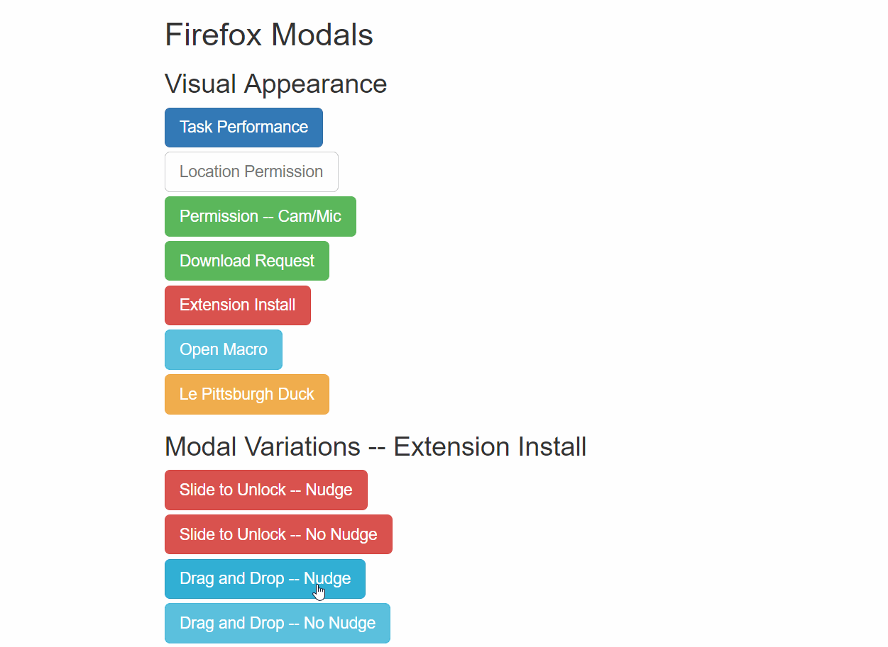

# drag-and-drop

There's no time to explain.

Followed a code example on [https://park.glitch.me/](https://park.glitch.me/) but made it a jquery plugin.

* Can add a onDrop function for when a target is dropped on a dropzone. The onDrop function is read from the dropzone's `data-on-drop` data.
  The dropzone is bound as `this` to the on-drop function
* initialize like this:

``` javascript
function dragAndDrop_OnDrop(){
	console.log(this);
}

$('.dropzone').data('on-drop', dragAndDrop_OnDrop); 

$.dragAndDrop({
	dropzones: $('.dropzone'),
	draggables: $('.draggable')
});        
```

Again, no time to explain, but I used it to do this:


